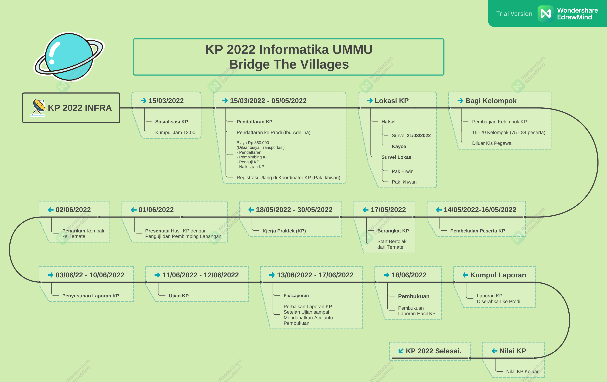
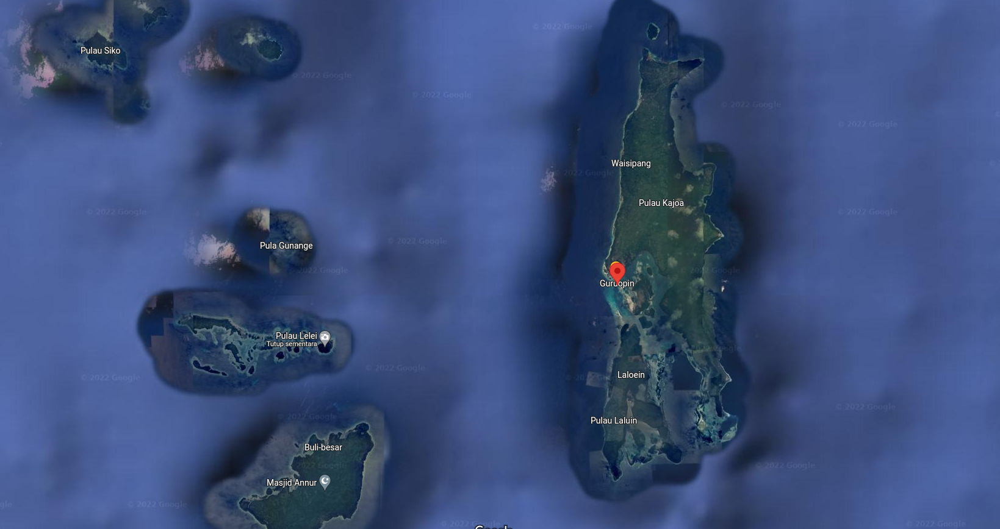

# KP Informatika UMMU 2022

## Mind Map KP 2022 INFRA

## Alur KP 2022 INFRA

### 1. `Sosialisasi` - 15/03/2022
* Sosialisasi KP 2022 INFRA di LAB Jaringan Lt.3.
<!-- * Oleh Pak. Ikhwan dan Pak Sahrial -->

### 2. `Pendaftaran KP` - 15/03/2022 - 05/05/2022 
* Pendaftaran KP 2022 ke Prodi (Ibu Adelina)
* Biaya KP 2022, Rp 850.000
    * TIDAK Termasuk Biaya Transportasi ke Lokasi
    * Untuk Pendaftaran
    * Untuk Pembimbing KP
    * Untuk Penguji KP
    * Naik Ujian KP
* Daftar Ulang ke Koordinator KP (Pak Ikhwan), [LINK Registrasi Ulang](https://forms.gle/5cuNf1R2CYGniSvP6){:target="_blank"}.

### 4. `Lokasi KP 2022 INFRA` 
* Lokasi KP 2022 INFRA adalah di Kepulauan Kayoa Kab. Halsel.

    [Peta Pulau Kayoa: ](https://www.google.com/maps/place/Guruopin,+Kec.+Kayoa,+Kabupaten+Halmahera+Selatan,+Maluku+Utara/@0.0065855,127.4023242,15z/data=!3m1!4b1!4m5!3m4!1s0x329d5624c188c397:0xd70ecd1ea91ed918!8m2!3d0.006566!4d127.4110758){:target="_blank"}.    

### 5. `Bagi Kelompok`
* Setiap Kelompok Terdiri dari 6-8 orang Mahasiswa dan Seorang Dosen Pembimbing. 
* Jumlah kelompok kisaran 9-11 Kelompok.
* Setiap kelompok menunjuk seorang sebagai ketua kolompoknya masing-masing.

### [NEW Update] Daftar Kelompok
				
#### INFRA-1 - Desa Laloin
1. Sri Ayu A. Salauwe		
2. Nur Sabrina		
3. Ahmad Raihan La Gia		
4. Rasmin Syamsudin		
5. Bahrin Wadi		
6. Riswal Alim		
				
				
#### INFRA-2 - Desa Ngokomalako
1. Siti Nabila Marjan		
2. Ira M. Fataruba		
3. Sarifudin Soleman		
4. Muhammad Fajri Soleman		
5. M. Akib Hasan		
6. Muhammad Tezar A. Hayat		
				
				
#### INFRA-3 - Desa Tawabi
1. Nurlinda Sumardi		
2. Nurdila Cecene		
3. Jiljian Abdul Aziz		
4. Hardian Umamit		
5. Moh Riski Tidore		
6. Julfikar Diawan		
				
				
#### INFRA-4	- SMKN 4 Bajo
1. Nadila Nursaifa Abjan		
2. Nofita Ridwan		
3. Zull Juliyadi Duwila		
4. Asrul Limatahu		
5. Isnawi Hi Salim		
6. Muhyiy A. Gorotomole		
				
				
#### INFRA-5	- Desa Ngute-Ngute
1. Julianti R Buhay		
2. Aldinafira		
3. Jerri Aprianto Polibu		
4. Fakhrul Rizki Parman		
5. Alfian Sukur		
6. Rahma Ibrahim
7. Julkifli Akka
				
				
#### INFRA-6	- Desa Laromabati
1. Nurul Safitry Darwin		
2. Nadia Loga		
3. Dhani H. Abas		
4. Yusri Jalil Yusuf		
5. Sanusi Usia		
6. Elsa Gete Gete		
7. Susilawati Suwardi		
				
#### INFRA-7 - Desa Modayama
1. Siti Nuraini Ramadhani		
2. Wulansari Hafel		
3. Muhammad Taufik R. Syarif		
4. Rahmat Fabanyo		
5. M Khaidar		
6. Fahman M. Saleh		
				
				
#### INFRA-8	- SMAN 10 Laluin	
1. Mardiana Tamaronggehe		
2. Giok Berbyna Puspitasary Burhanudin		
3. Muhammad Riswanto Ahmad		
4. M. Rizky S. Diasamo		
5. Yusril A. Rahman		
6. Alvian Zakaria		
7. Rahmi Arivani Hanafi		
				
#### INFRA-9	- Desa Wayasipang
1. Hartati Buamona		
2. Marisa S Salama		
3. Sorono Warjo Saudin		
4. Arjuna		
5. M. Ikbal A. Muloko		
6. Niningsih Ramli
7. Dasrianto Maulana
				
				
#### INFRA-10 - Desa Karamat		
1. Fivi Findri Odameng		
2. Siti Elvia Unab		
3. Muhammad Affandy Soangare		
4. Erdin La Dunga		
5. Rahmatul Salamat		
6. Julfikar Fahredji		
7. Putri Rahmanda Husni		

#### INFRA-11	- Desa Ori Makurunga

1. Ramah  Zaludin
2. Jabir M. Robo
3. Nurindah Umasugi
4. Julkifli abjan
5. Risaldi Rajaguru
6. Nursianti Putri Umasugi
7. M. Faldini L. Ahya
8. Windi Fokotea

### 6. `Pembekalan` - 14/05/2022 - 15/05/2022
* Semua Mahasiswa sudah harus tiba kembali di Ternate dari Liburan SEBELUM Tanggal 14/05/2022.
* Pembekalan KP 2022 INFRA berlokasi di Ruang LAB Jaringan, 
* Waktu Pembekalan berturut-turut dari tanggal 14 dan 15  bulan Mei (05) 2022. 

###   [NEW Update] `Pembekalan` 14/05/2022 - 14/05/2022 
* Pembekalan KP Teknis INFRA hari _**Sabtu 14 Mei Jam 09.30 - Selesai**_,  oleh Pak Erwin dan Kak Fatur.
* Pembekalan Umum hari Ahad 15  Mei, Jam 09.30 - Selesai, **_`Gabungan SI dan INFRA`_** oleh **Prodi Informatika**
* Pembekalan Lanjutan INFRA hari **Senin 16  Mei, Jam 13.00 - Selesai** Oleh Pak Erwin 

### 7. `Berangkat ke Lokasi` - 17/05/2022
* Tanggal 17 Mei berangkat ke Lokasi KP 2022 Kayoa (**Bisa Berubah sesuai Jadwal Kapal**)
* Berangkat menggunakan KM. C...Dua.., dengan Dermaga Tujuan Guraping Kayoa
* Berangkat Pagi jam 07.30, semua Mahasiswa sudah harus siap di Dermaga SEBELUM jam tersebut.
* Kelompok yang di Pulau Kayoa harus membawa Sepeda Motor.

###   [NEW Update] `Berangkat ke Lokasi` - 17/05/2022 
* Waktu Berangkat naik KM. dan Tiba Turun KM. pake Jas Almamater RAPI (strika jas tu). 
* Foto bersama saat berangkat dan tiba pake Jas Almamater  sambil memegang spanduk/baliho
* Semua Mahasiswa harus ADA dan Pakai ID Card
* Masing-masing ketua kelompok memeriksa dan meng-absen anggotannya saat berangkat dan saat tiba, kemudian melaporkan ke koordinator KP 2022 (Pak Ikhwan).

### 8. `Di Lokasi KP` - 18/05/2022 - 30/05/2022
* Kerja Praktek INFRA 2022 di Lokasi Masing-masing
* Setiap Kelompok Membuat Laporan KP 
* Menjelang Selesai KP, Setiap kelompok agar Mempersiapkan Laporan Sementara untuk Dipresentasikan di tempat KP masing-masing.

### 9. `Presentasi Laporan` - 01/06/2022
* Setiap Kelompok sudah siap dengan Laporan KP-nya
* Setiap Kepompok Mempresentasikan Laporannya KP-nya di Tempat KP-nya masing-masing.
* Menyerap masukan dan saran untuk laporan yang lebih baik. 
* Persiapan Kembali Berkumpul di Guraping Kayoa untuk persiapan Penarikan kembali ke Ternate.

### 10. `Penarikan Kembali Ke Ternate` - 02/06/2022
* Semua kelompok sudah berkumpul di Guraping untuk Siap-siap kebali ke Ternate
* Berangkat Dari Kayoa Jam 7.30 kembali ke Ternate.

### 11. `Penyusunan Laporan Akhir KP` -  03/06/2022 - 10/06/2022
* Setiap Kelompok menyusun Laporan KP-nya yang siap untuk diujikan. 
* Setiap Kelompok agar Melengkapi Laporan KP-nya dengan Foto Dokumentasi
* Menulis Laporan mengikuti Format atau Template yang disediakan oleh Prodi.
* Download Buku Panduan KP Informatika: [BUKU_PANDUAN_KP_Informatika.docx](assets/BUKU_PANDUAN_KP.docx)
* Jadikan Jurnal PKM

### 12. `UJIAN KP 2022` -  11/06/2022 - 12/06/2022
* Ujian KP 2022 INFRA pada tanggal 11 dan 12 Juni 2022

### 13. `FIX Laporan` -  13/06/2022 - 17/06/2022
* Setiap kelompok segera memperbaiki Laporannya setelah ujian Jika terdapat catatan perbaikan.
* Perbaiki laporan sampai memdapatkan ACC untuk Pembukuan dari Pembimbing dan Penguji.

### 14. `Pembukuan Laporan KP` -  18/06/2022
* Segera dibukukan jika sudah mendapatkan ACC untuk itu.
* 

### 15. `Kumpul Lporan KP` 
* Jika Sudah dibukukan segera kumpul hasil akhir laporan KP 2022 masing-masing kelompok ke Prodi dalam bentuk cetak/buku.
* Kumpul juga Laporan dalam bentuk Soft Copy (**file DOCX dan PDF**)

### 16. `Nilai KP 2022` 
* Nilai KP 2022 keluar setelah semua proses selesai. 

### 17. `KP 2022 INFRA SELESAI`.
* KP 2022 INFRA INFORMATIKA UMMU dinyatakan SELESAI.

*** 

by: koordinator.kp2022